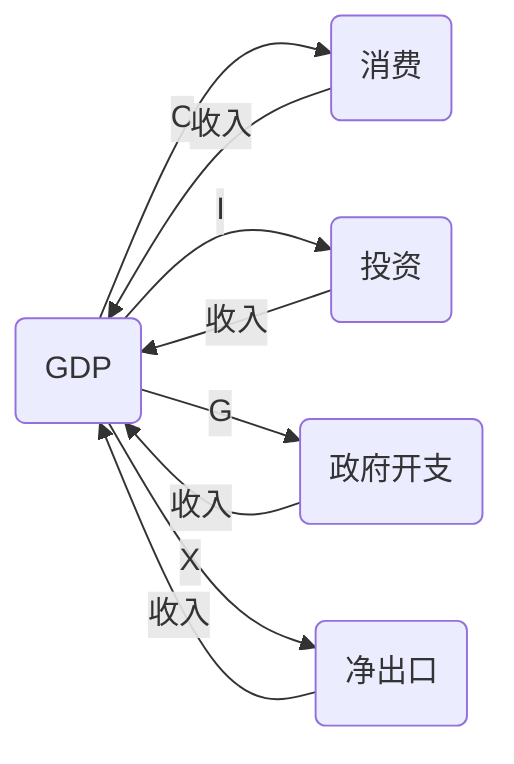

美国的国内生产总值（GDP）是通过国家统计局（Bureau of Economic Analysis）进行统计的。该机构使用多种方法来估算和计算GDP，包括但不限于以下几种方法：

1. 支出法：通过对消费、投资、政府支出和净出口等方面的支出进行统计，来估算国内生产总值。

2. 收入法：通过对劳动报酬、利润、利息和税收等方面的收入进行统计，来估算国内生产总值。

3. 生产法：通过对各个产业的生产价值进行统计，来估算国内生产总值。

这些方法通常会结合使用，以确保对GDP的估算尽可能准确。同时，国家统计局也会定期对这些方法进行修订和更新，以反映经济结构和活动的变化。

