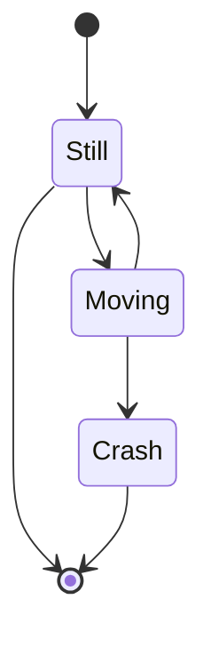

### 略读曼昆《宏观经济学》第十人大版 及英文版第11版

**以下文字为 Cursor.so 的 gpt-4 生成**

在阅读曼昆的《宏观经济学》第十版后，我深感其深厚的学术底蕴和严谨的逻辑推理。这本书以其独特的视角，为我们揭示了宏观经济学的核心理念和基本框架。

曼昆的语言清晰，逻辑严密，使得复杂的经济理论变得易于理解。他的观点既有深度，又不失广度，使得读者能够全面地理解和掌握宏观经济学的基本原理。

然而，尽管这本书的内容丰富，但并不意味着它是无懈可击的。在某些章节中，我发现曼昆的观点有时过于理论化，缺乏对现实世界复杂性的充分认识。此外，他的一些论述也可能过于依赖数学模型，而忽视了经济学的社会和历史背景。

总的来说，曼昆的《宏观经济学》是一本值得一读的经典之作。它既可以作为经济学入门读物，也可以作为经济学者深入研究的参考书。虽然它并非完美，但它的优点远远超过了其缺点，使得我们能够更好地理解和应用宏观经济学的知识。

